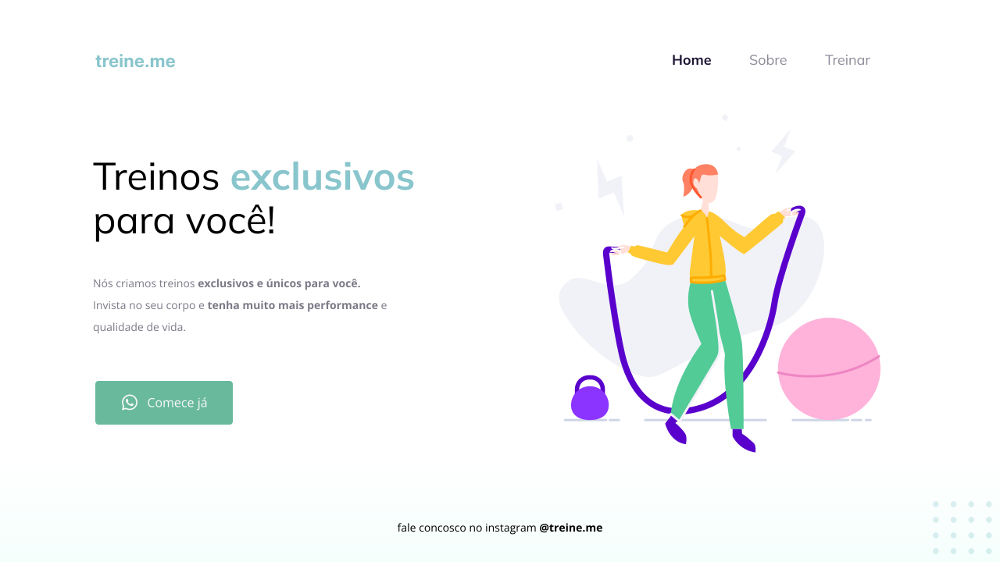

<strong> <h1 align="center"> Treine.me</h1></strong>

## 🚀 Tecnologias

Esse projeto foi desenvolvido com as seguintes tecnologias:

- HTML
- CSS
- Git e Github

## 🏷️ Layout

Você pode visualizar o layoout do projeto através
[desse link](<https://www.figma.com/design/4CpPdumjkOg26nsyxkxqEd/Explorer---Projeto-02-(Copy)?node-id=0-1&p=f&t=1MZllzCOFRiHVIgA-0>).
É necessário ter uma conta no [Figma](https://www.figma.com)